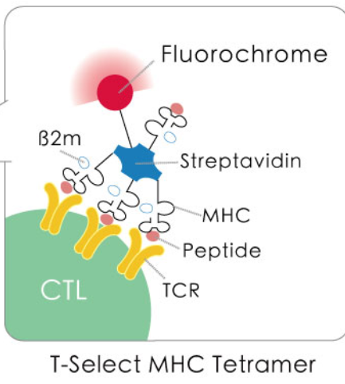
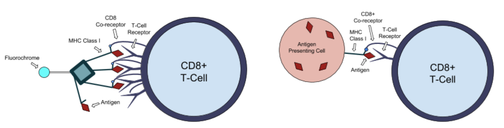

# **👍SRTP个人笔记👍**

- ## 基础知识📕

本项目的主题是从bulkTCR测序数据中鉴定疾病特异TCR序列。基础知识梳理如下：

- bulkTCR测序数据：<br>
TCR序列通过RNA测序或DNA测序获得。<br>
对于RNA测序，可以通过单细胞测序或群体测序的方式获得单个细胞或细胞群体的TCR序列。<br>
对于DNA测序，可以通过PCR扩增或文库构建等方法获得TCR序列。<br>
bulkTCR测序提供极大数量的TCR测序数据，但无法获得单个TCR的α链和β链的完整配对信息。<br>
- 疾病特异TCR序列：<br>
可以通过测序和比对T细胞克隆型的TCR序列来鉴定。<br>
常见的方法是使用批量TCR测序技术获取疾病样本中的TCR序列数据，然后与健康对照样本进行比较分析，找出在疾病样本中显著丰度增加或特异存在的TCR序列。<br>
主要使用CDR3序列鉴定。<br>
- TCR序列：<br>
TCR由α链和β链组成，它们通过非共价键结合形成完整的TCR分子。<br>
V (Variable)：V基因段负责编码可变区域的序列。V基因段的序列在不同的T细胞克隆型之间具有较高的变异性，这使得T细胞能够识别多样的抗原。<br>
D (Diversity)：D基因段负责增加TCR的多样性。D基因段的存在使得在V和J基因段之间可以发生额外的基因段重组，从而增加了TCR序列的多样性。<br>
J (Joining)：J基因段负责连接可变区域和常规区域。J基因段的序列在不同的T细胞克隆型之间也具有一定的变异性，但相对较小。<br>
C (Constant)：C基因段负责编码TCR的常规区域的序列。C基因段的序列相对稳定，不像可变区域那样具有高度的变异性。<br>
CDR3 (Complementarity Determining Region 3) 是TCR序列中的一个重要区域，是TCR中最变异的区域，其在TCR克隆型间具有高度可变性。
由V和J基因段的连接以及CDR3区域内的N区域（由D基因段的连接导致）组成。
CDR3区域对于TCR的抗原结合特异性至关重要，它通过与抗原结合位点相互作用，参与了抗原的识别和结合。<br>
- MHC tetramer：<br>
MHC tetramer technology is based on the ability of MHC-peptide complexes to recognize the antigen-specific T cells
at a single cell level. This breakthrough technology enables researchers to precisely measure targeted T-cell responses 
in infectious diseases, cancer, and autoimmune diseases.<br>
 <br>
中间streptavidin是细菌来源蛋白质，用于连接MHC(应该是I型)和荧光标记物。<br>
这种四聚体可以利用TCR立体结构上的特征直接捕捉到特异性的CTL。<br>
**Wiki上的图也很好😀：**<br>
 <br>

- ## pipeline概述🐢

### 1. prefetch下载数据与fastq-dump转换格式

```shell
projects=$(cat "prefetch项目列表路径")
for project in $projects
do
    echo $project
    mkdir -p "创建项目目录路径"
    mkdir -p "项目原始数据目录路径(01_sra)"
    prefetch $project -O "项目原始数据目录路径(01_sra)"

    mkdir "项目fastq.gz文件目录路径(02_fastq_gz)"
    for i in "项目原始数据目录路径(01_sra)/*RR*" #这里*RR*匹配了SRR*和ERR*原始数据文件
    do
        fastq-dump.3.0.0 ${i}/* \
        --split-files \
        --gzip --outdir \
        "项目fastq.gz文件目录路径(02_fastq_gz)"
    done

    rm -rf "项目原始数据目录路径(01_sra)" #获取fastq.gz后删除
done
```

后来发现其实fastq-dump可以直接从ncbi中拉去sra转化后的fastq.gz文件。😡

如果只需求fastq.gz的话，没有必要使用prefetch project。😔

### 2. Trimmomatic质量控制与序列剪切✂

```shell
# 我们用了fastq-dump的split参数。双端测序文件会输出sampleID_2.fastq.gz文件，而单端只有_1。
if [ -e "fastq.gz文件夹路径/${sample_ID}_2.fastq.gz" ]; then
    echo "Running Trimmomatic: 双端分析 - $sample_ID"
    # 使用Trimmomatic的双端分析
    trimmomatic PE \
    "$project_folder/02_fastq_gz/${sample_ID}_1.fastq.gz" \
    "$project_folder/02_fastq_gz/${sample_ID}_2.fastq.gz" \
    "$output_file/${sample_ID}_1_paired.fastq.gz" \
    "$output_file/${sample_ID}_1_unpaired.fastq.gz" \
    "$output_file/${sample_ID}_2_paired.fastq.gz" \
    "$output_file/${sample_ID}_2_unpaired.fastq.gz" \
    ILLUMINACLIP:Trimmomatic-adapter.fa:2:30:10 \
    SLIDINGWINDOW:8:25 \
    LEADING:25 \
    TRAILING:25
else
    echo "Running Trimmomatic: 单端分析 - $sample_ID"
    # 使用Trimmomatic的单端分析
    trimmomatic SE \
    "$project_folder/02_fastq_gz/${sample_ID}_1.fastq.gz" \
    "$output_file/${sample_ID}_trimmed.fastq.gz" \
    ILLUMINACLIP:Trimmomatic-adapter.fa:2:30:10 \
    SLIDINGWINDOW:8:25 \
    LEADING:25 \
    TRAILING:25
fi
```

去adapters

质量分数过滤

去除低质头尾

双端测序文件与单端测序文件分别质控

质控标准参照TCRdb标准

### 3. MixCR及其他可能工具的分析

### MixCR

```shell
# 检查是否双端测序，QC部分双端质控输出sampleID_2_paired.fastq.gz
if [ -e "输入路径/${sample_ID}_2_paired.fastq.gz" ]; then
    echo "Running MixCR: 双端分析 - $sample_ID"
    mkdir -p "输出路径/$sample_ID"
    mixcr analyze generic-tcr-amplicon \
        --species hs \
        --dna \
        --floating-left-alignment-boundary \
        --rigid-right-alignment-boundary \
        --keep-non-CDR3-alignments \
        "输入路径/${sample_ID}_1_paired.fastq.gz" \
        "输入路径/${sample_ID}_2_paired.fastq.gz" \
        "输出路径/$sample_ID"/"$sample_ID"
else
    echo "Running MixCR: 单端分析 - $sample_ID"
    mkdir -p "输出路径/$sample_ID"
    mixcr analyze generic-tcr-amplicon \
        --species hs \
        --dna \
        --floating-left-alignment-boundary \
        --rigid-right-alignment-boundary \
        --keep-non-CDR3-alignments \
        "输入路径/${sample_ID}_trimmed.fastq.gz" \
        "输出路径/$sample_ID"/"$sample_ID" 
fi
```

指定输入数据是DNA序列数据

双端测序文件与单端测序文件分别分析

左端软对齐，右端硬对齐

保留除CDR3外其他区域的比对结果

这个脚本能跑出所有期望格式的文件，但参数选择是否正确存疑。😵

### IMGT/V-QUEST

IMGT，the international ImMunoGeneTics information system, 一个数据库。

有时候翻墙不翻墙都进不去。😡

但这个数据库非常的厉害，TCR数据非常新的，很多分析工具都参照它。✌

上游分析结果完整：

- V，J区域功能性，基因、等位基因，区域得分，一致性百分比，一致性碱基数

- D基因、等位基因

- CDR1，CDR2，CDR3长度

- FR长度

- 氨基酸连接区

- 序列方向

- 序列

- 5'端修剪的核苷酸数目、3'端修剪的核苷酸数目

- 分析序列长度

- 序列分析类别

- 其他注释

唯一的缺点就是这个网页工具不支持高通量测序数据，一次最多分析50个序列。

但这个缺点是致命的，直接宣告这个工具的死亡。🙅

### IMGT/HighV-QUEST

IMGT/HighV-QUEST是该数据库提供的用于注释、比对和分析TCR和BCR序列的功能和特征的工具。（高通量哦）

注册很费劲。还要以企业/机构名义注册。身份选择最捞是PI。我一个undergraduate瑟瑟发抖。😥😅

输出结果和V-QUEST差不多（Summary），还有细节文件，感觉比MixCR更细致，尤其是V，J区域，很细，MixCR的VJ信息反馈太少。

处理很难办，是网页工具。虽然结果不错，但又慢又麻烦。看看未来有没有解决方法。💪

### IgBLAST

即Immunoglobulin BLAST，用于序列比对，功能注释，突变分析，克隆分析。主要针对TCR序列和抗体序列。
提供了丰富的序列比对信息（比对NCBI数据库信息）。

**不同之处：**

IgBLAST使用BLAST搜索算法。

IgBLAST使用NCBI提供的免疫球蛋白基因库作为参考序列库，

IgBLAST使用特定的替代突变模型来处理抗体和TCR序列中的突变。

IgBLAST支持FASTA格式的序列作为输入。

### 4. 序列过滤去重

这一步可能不需要，trimmomatic已经做了过滤。

### 5. 序列特征提取

主要提取分析工具提供的CDR3序列的注释。V，D，J序列特征也要考虑。

### 6. 无监督学习

最终关卡。

TCRdist3是一个用于测量和比较TCR（T细胞受体）序列相似性的工具。它基于TCR序列的特征和V(D)J基因的信息，计算出两个TCR序列之间的距离分数。

t-SNE（t-Distributed Stochastic Neighbor Embedding）：
t-SNE是一种流行的降维技术，可以将高维数据映射到低维空间，同时保留原始数据的局部结构。它常用于可视化TCR数据中的潜在结构和模式。

PCA（Principal Component Analysis）：
PCA是一种常用的线性降维技术，可以将高维数据映射到较低维度的空间，以保留数据中最显著的方差。在TCR数据分析中，PCA可以帮助发现主要的特征和相关结构。

K-means聚类算法：
K-means是一种常见的聚类算法，用于将数据分为预定义数量的簇。在TCR数据中，K-means可以用于发现相似的TCR序列分组，并将它们归类到具有相似特征的簇中。

DBSCAN（Density-Based Spatial Clustering of Applications with Noise）：
DBSCAN是一种基于密度的聚类算法，可以识别具有相似密度的数据点形成的簇。
在TCR数据分析中，DBSCAN可以帮助发现具有不同密度的TCR序列组成的簇，从而揭示潜在的子群。

- ## 文献阅读📚

- doi:10.1038/nm.4267
早会的文章。和SRTP关系不大。讲了炎性小体基因模块表达对于老年人健康与长寿的影响。
发现会使老年人短寿，全因死亡率提高，易患高血压，动脉硬化。<br>
与代谢物是有关的，代谢物会上调基因表达和细胞因子分泌。<br>
咖啡因会抑制炎性小体基因模块表达
- DOI:1093.382/nar/GKT<>
"尽管这些工具提供了有价值的分析功能，例如种系基因鉴定，FR和CDR描述以及突变分析，但它们具有各种局限性。
例如，它们都缺乏搜索更全面的数据库（如NCBI nr或基因组数据库）的能力，以及搜索蛋白质序列的能力。
此外，这些工具要么处理大量查询序列的速度很慢，要么完全缺乏这种能力。"<br>
这是IgBLAST的自评。👍<br>
有很多高深的东西未曾了解，但总体看来，IgBLAST主要的特色是它使用BLAST算法，使用数据库nb。<br>
但是它也是目前了解到少数的又有网页工具又有命令行的工具之一。👍
- Nature Communications volume 4, Article number: 2333 (2013)
Illumina测序，其主要优点是生成非常深的数据，但缺点是读取长度短，数据要么需要组装，要么专门关注CDR3。
454测序是一种高通量测序技术，原理为荧光原位合成（pyrosequencing）。细节也不用了解。
"Presently, TR repertoire investigation is limited by two polarizing challenges. 
At one end, high-throughput sequencing alone cannot correlate a clonotype with its functional parameters. 
At the other end, Sanger sequencing of sorted cells has low throughput 
and the method depends on prior knowledge of the antigen and/or the antigen-specific cells, 
thus often missing many antigen-specific populations. 
Combining high-throughput TR immunoprofiling using IMGT/HighV-QUEST analysis with cell identity-oriented approaches 
will bring genuine advances in TR repertoire studies in health and disease."<br>
这是HighV-QUEST的自评。👍😅😂
- Nature volume 547, pages89–93 (2017)
讲了他们开发的预测TCR特征的流程以及一系列工具。<br>
流程大致如下：<br>
  1. 获取TCR的一系列信息。
  2. TCRdist进行TCR相似性定量测量。两个TCR之间的TCRdist距离定义为两个受体的潜在pMHC接触环之间的相似性加权错配距离。
  3. 对表位特异性受体，这里是TCR，进行基于TCRdist的聚类，并构建层次距离树。
  4. 使用TCR logo representation工具注释簇。
  5. 为检测非种系编码的基序是否可能成为特异性的主要贡献者，对过度表达的 CDR3 序列基序进行了统计分析，同时考虑到重排过程引入的潜在序列偏差。
  6. 使用TCRdiv来定量评估表位特异性库内的受体多样性和密度。通过捕获受体之间除了精确身份之外的相似性来概括辛普森多样性指数。
  7. 使用repertoire-specific nearest-neighbour score(NN-distance)测量受体密度，量化聚集和发散TCR的相对贡献。
  8. 使用TCR分类器测试TCRdist的预测能力。测量分类器在随机生成的背景受体池中识别表位特异性受体的敏感性和特异性。
  9. 使用流感感染小鼠样本验证TCR分类器的功能。
- https://doi.org/10.1016/j.compbiolchem.2020.107281
讲了一种新的预测TCR表位的计算方法SETE。
SETE工作流程😊：
1. 收集 CDR3 序列及其结合表位作为输入。
2. 将 CDR3 序列编码为原始特征矩阵。每个序列被解构为长度为3的重叠的连续短氨基酸链。
3. 所有解构的基序形成原始特征矩阵。
4. 提取特征并用PCA降维得到最终的特征矩阵。
5. 将特征矩阵输入 GBDT 分类器以测试SETE的分类能力。

- ## 其他❓

### TRUST4

TRUST4已在pipeline中被舍弃。但古早编写的脚本可能还有存在的价值。💴💎

```shell
projects=$(cat "TRUST4项目列表路径")
for project in $projects
do
    mkdir "${project}"/03_trust4_output
    for i in ./"${project}"/02_fastq_gz/*RR*
    do 
        echo $i
        run-trust4 -u ${i} \
        -f /mnt/volume3/trn/04_benchmark/01_trust4/refdata/tcr.fa \
        --ref /mnt/volume3/trn/04_benchmark/01_trust4/refdata/IMGT+C_tcr.fa \
        -o ./"${project}"/03_trust4_output/$(echo "$i" | sed -n 's|.*/\(SRR[^.]*\).*|\1|p')
    done
done
```

### VDJtools

这个工具耗了不少时间学习，也尝试运作了很久。

它可用于分析bulkTCR测序数据，尤其是对于克隆型的分析：评估丰度，计算多样性指标，分析克隆型信息，还可以提供聚类分析支持，以及可视化。

只因🐓他太美，**太难学了**。

### 爬虫

我本身没有参与爬虫脚本编写，但是因为在自己的电脑中运行了脚本，因此将脚本加入笔记🖊：

[step1.py](%C5%C0%B3%E6%2Fstep1.py) #爬取TCRdb网站中样本信息

[step2.py](%C5%C0%B3%E6%2Fstep2.py)
[step3.py](%C5%C0%B3%E6%2Fstep3.py) #整理csv文件格式

### 转换格式

这是几个古早转换文件格式的脚本。目前可能已经不合适了，但框架可以供以后参考：

tsv to csv:
```python
import csv
import re
import glob

# 获得所有report文件
path_lib = glob.glob(r'./Projects/*/03_trust4_output/*_report.tsv')
print(len(path_lib))

# 转换csv
with open('csv_report.csv', 'a',newline='') as output_file:
    tsv_writer = csv.writer(output_file)
    # 写tsv文件条目名
    header = ['sample_ID','#count',	'frequency','CDR3nt','CDR3aa',
              'V','D','J','C','cid','cid_full_length','a/b_chain']
    tsv_writer.writerow(header)

    # 打开所有report子项目
    for path in path_lib:
        print(f'{path}')
        with open(path, 'r') as input_file: 
            # 去除条目
            next(input_file)
            # 读取tsv文件
            tsv_reader = csv.reader(input_file, delimiter='\t')

            # 样本ID
            sample_ID = re.findall(r"SRR[^_]*",f'{path}')

            for row in tsv_reader:
                if sample_ID:
                    # 加ID
                    row.insert(0,sample_ID[0])
                    # 加轻重链
                    row.append(row[-3][:3])
                    
                    tsv_writer.writerow(row)
```

csv to json:
```python
import csv
import json

csvFile = "csv_report.csv"
jsonFile = "json_report.json"

data = []

with open(csvFile) as csvFile:
    csvReader = csv.DictReader(csvFile)
    for rows in csvReader:
        item = {}
        for field in csvReader.fieldnames:
            item[field] = rows[field]
        data.append(item)

with open(jsonFile, 'w') as jsonFile:
    jsonFile.write(json.dumps(data, indent=4))
```

...

### new?